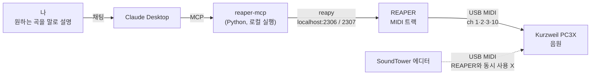

# PC3X × REAPER × Claude: 말로 시키면 하드웨어 신디가 연주하는 작곡 환경

2008년 무렵 나온 하드웨어 워크스테이션 Kurzweil PC3X를 DAW(REAPER)와 AI(Claude)에 연결했다. 이제 자연어로 반주를 만들게 하고, 그 결과를 실제 PC3X 소리로 바로 들을 수 있다. 이 문서는 프로젝트를 왜 했는지, 어떻게 연결했는지, 어디서 막혔고 어떻게 풀었는지를 정리한 보고서다.

- 작성일: 2026-10-04
- 따라 하기용 단계별 설명: [GUIDE.md](GUIDE.md)

## 목차

1. [왜 만들었나](#왜-만들었나)
2. [목표](#목표)
3. [환경](#환경)
4. [시스템 구조](#시스템-구조)
5. [진행 과정](#진행-과정)
6. [트러블슈팅 기록](#트러블슈팅-기록)
7. [결과](#결과)
8. [한계와 알려진 문제](#한계와-알려진-문제)
9. [보안 고려사항](#보안-고려사항)
10. [다음 단계](#다음-단계)
11. [파일 구성](#파일-구성)

## 왜 만들었나

**하드웨어는 있는데 쓰는 법을 몰랐다.** PC3X에는 공장 프리셋이 1,000개 넘게 들어 있고, 셋업(최대 16존), 아르페지에이터, 시퀀서, 이펙트 체인까지 기능이 많다. 그런데 이걸 작은 LCD와 버튼으로 다뤄야 한다. 어떤 소리가 몇 번에 있는지, 어떻게 섞는지부터 막막했다.

**컴퓨터 화면으로 편하게 다루고 싶었다.** 소리 편집은 SoundTower 데스크탑 에디터로 하면 된다. 하지만 에디터에는 녹음 기능이 없어서, 곡을 만들려면 결국 DAW가 필요했다.

**AI에게 말로 반주를 시키고, 그걸 내 악기 소리로 듣고 싶었다.** 소프트웨어 악기로 AI 작곡을 하는 사례는 많다. 이 프로젝트는 반대로, AI가 만든 음표를 **내가 가진 하드웨어 신디**가 연주하게 하는 데 초점을 뒀다. 그러려면 AI가 DAW를 직접 조작해야 했고, 그 연결 고리로 MCP(Model Context Protocol)를 썼다.

**MCP가 실제로 어떻게 동작하는지 직접 다뤄 보고 싶었다.** AI 앱이 내 PC의 프로그램을 어떻게 제어하는지, 커뮤니티가 만든 MCP 서버를 로컬에서 돌린다는 게 어떤 의미인지 세팅하면서 확인했다. 관련 내용은 [보안 고려사항](#보안-고려사항)에 정리했다.

## 목표

1. PC3X의 사운드와 기능을 파악하고 정리한다.
2. 컴퓨터(SoundTower 에디터)로 소리와 셋업을 편집한다.
3. DAW로 녹음·편집할 수 있게 한다.
4. Claude가 DAW를 조작해 반주를 만들고, 그 음표를 PC3X가 연주하게 한다.
5. 처음 보는 사람(미래의 나 포함)이 처음부터 다시 세팅할 수 있도록 문서로 남긴다.

## 환경

| 구분 | 항목 |
| --- | --- |
| 악기 | Kurzweil PC3X (88건반), OS v2.21로 업데이트 |
| 컴퓨터 | Windows 11 |
| 편집기 | SoundTower PC3 Sound Editor (Windows) |
| DAW | REAPER 7.81 (평가판) |
| 언어 런타임 | Python 3.14 |
| MCP 서버 | [reaper-mcp](https://github.com/bonfire-systems/reaper-mcp) (bonfire-systems, MIT, 도구 60개) |
| REAPER 원격 제어 | [python-reapy](https://github.com/RomeoDespres/reapy) 0.10.0 |
| AI 클라이언트 | Claude Desktop (Windows) |
| 연결 | PC3X ↔ PC: USB (MIDI만 전송, 오디오는 PC3X 출력 단자) |

## 시스템 구조



1. 내가 Claude Desktop에 곡을 말로 설명한다.
2. Claude가 reaper-mcp의 도구(트랙 만들기, 음표 넣기, 템포 설정 등)를 호출한다.
3. reaper-mcp는 python-reapy로 REAPER 안의 reapy 서버에 명령을 보낸다.
4. REAPER는 트랙마다 지정된 MIDI 채널로 음표를 PC3X에 보낸다.
5. PC3X가 채널별 악기(드럼 10, 로즈 1, 베이스 2, 패드 3)로 소리를 낸다.

PC3X 쪽에는 이 채널 구성에 맞춘 "REAPER Mixer" 셋업을 만들었다. 셋업을 부르면 채널별 악기가 자동으로 걸리고, PC3X 슬라이더 A~D가 트랙별 볼륨 페이더가 된다.

## 진행 과정

| 단계 | 한 일 | 결과물 |
| --- | --- | --- |
| 1 | PC3X 공식 오브젝트 리스트로 공장 프로그램 1,084개(GM 128개 포함) 번호와 이름 정리, 용도별 추천 레이어·스플릿 조합 작성 | 사운드 리스트, 조합표 |
| 2 | 매뉴얼 기반으로 모드 8개, 편집 페이지, 셋업, 이펙트, 시퀀서, MIDI 기능 정리 + 용어 사전 | 기능 가이드 |
| 3 | OS v2.21 업데이트 (부트로더 → 파일 시스템 도구 → 포맷 → OS·오브젝트 설치) | 에디터 사용 조건 충족 |
| 4 | SoundTower 에디터 연결, EP 조합·8존 라이브 셋업 제작 (Bank 버튼 뮤트, 슬라이더 볼륨) | PC3X 셋업 |
| 5 | DAW 선정. Windows에서 MCP 설치가 가장 단순한 REAPER + reaper-mcp 조합 선택 | 설계 |
| 6 | Python, reaper-mcp, REAPER 설치. ReaScript·reapy 연결 문제 해결 | REAPER 원격 제어 |
| 7 | Claude Desktop에 MCP 서버 등록, 연결 확인 | Claude → REAPER 제어 |
| 8 | Claude로 네오소울 8마디(드럼·베이스·EP·패드) 생성, .mid로 받아 REAPER에 넣고 PC3X로 재생 | 첫 곡 재생 |
| 9 | PC3X "REAPER Mixer" 셋업으로 채널별 악기 자동 설정 + 슬라이더 볼륨 | 하드웨어 믹서 |
| 10 | 전체 과정 문서화 | GUIDE.md, 이 보고서 |

## 트러블슈팅 기록

### 1. REAPER가 Python을 못 찾음 / `.py` 스크립트를 못 불러옴

- **증상**: ReaScript 설정에 "No compatible version of Python was found". 나중에는 "No supported script files could be loaded".
- **원인**: 세 가지가 겹쳐 있었다.
  - dll 폴더 칸에 폴더가 아니라 파일 경로(`...\python314.dll`)를 넣었다.
  - dll 이름 칸에 오타(`python314Z.dll`)가 있었다.
  - Python을 찾은 뒤에도 **Enable Python for use with ReaScript** 체크가 풀려 있었다.
- **단서**: Load ReaScript 창의 파일 형식 목록에 `*.eel`, `*.lua`만 있고 `*.py`가 없었다. 설정 화면보다 이 목록이 실제 상태를 더 정확히 보여 줬다.
- **해결**: 폴더 경로와 dll 이름을 바로잡고, 체크를 켠 뒤 재시작했다.

### 2. reapy 자동 설정이 `KeyError: 'reaper'`로 실패

- **증상**: `reapy.config.enable_dist_api()`(REAPER 안), `reapy.configure_reaper()`(cmd) 둘 다 같은 지점에서 실패했다.
- **원인 분석**: reapy 소스를 보니, 자동 설정은 REAPER 설정 파일 `reaper.ini`를 직접 열어 `[reaper]` 섹션을 고친다. 이 환경에서는 그 파싱 단계에서 `[reaper]` 섹션을 찾지 못했다. 같은 코드를 Python 3.12와 3.14에서 테스트용 ini로 돌렸을 때는 정상이었다. 그래서 Python 버전보다는 이 PC의 REAPER 설정 파일과 reapy의 파일 탐색·파싱이 맞지 않는 문제로 봤다.
- **해결**: 자동 설정이 하는 일을 쪼개서 손으로 했다.
  - Python 활성화 → REAPER 환경설정 화면에서.
  - 포트 2307 웹 인터페이스 → Control/OSC/web에서 직접 추가.
  - reapy 서버 스크립트 → 액션으로 직접 등록하고 실행.
- **배운 점**: 자동화 스크립트가 실패하면, 그 스크립트가 무엇을 바꾸는지 소스에서 확인하고 같은 결과를 수동으로 만들 수 있다.

### 3. reapy 서버 스크립트 등록 실패

- **증상**: 등록용 스크립트는 "완료" 메시지를 띄웠는데 액션 목록에 activate_reapy_server가 없었다. 직접 불러오려 해도 실패했다.
- **원인**: 스크립트가 숨김 폴더(AppData) 안에 있었다. 같은 이름의 `.py`, `.pyc`, `.pyi`가 한 폴더에 있어서 파일 선택도 꼬였다. 1번의 Python 체크 문제도 함께 있었다.
- **해결**: `C:\reapy`로 `.py`만 복사해서 불러온 뒤 실행했다. "running in background" 확인창이 뜨면 Cancel을 눌러 서버를 유지했다.

### 4. Claude Desktop 설정 파일 수정

- **위험**: `claude_desktop_config.json`에는 이미 앱 설정이 들어 있다. MCP 예제를 그대로 덮어쓰면 기존 설정이 날아간다.
- **해결**: 기존 내용을 백업하고, 맨 끝 항목에 쉼표를 붙인 뒤 `mcpServers` 키만 추가했다. Windows 경로의 `\`는 JSON에서 `\\`로 이스케이프했다. 창 닫기가 아니라 트레이에서 Quit해야 설정이 다시 읽힌다.

### 5. MCP로 음표를 넣는 속도

- **증상**: 네 트랙 8마디(약 330음)를 Claude가 직접 넣자 패드 트랙만 끝나고 나머지가 밀렸다.
- **원인**: 이 MCP의 음표 도구는 한 번에 음표 하나만 넣는다. 호출마다 사용자 허용과 왕복이 필요하다.
- **해결**: 곡 단위 생성은 Claude에게 4트랙 `.mid` 파일로 받고, REAPER에 끌어다 놓는 방식으로 바꿨다. MCP 직접 제어는 템포·트랙·작은 수정에만 쓴다.

### 6. REAPER 페이더로 볼륨이 안 바뀜

- **원인**: 소리는 PC3X에서 나고 USB로는 MIDI만 오가서, REAPER 오디오 페이더는 아무것도 바꾸지 않는다.
- **해결**: PC3X 셋업에 채널 1·2·3·10용 존을 만들었다. 각 존의 건반 범위는 88건반 밖(C-1)으로 둬서 연주는 하지 않게 했고, 슬라이더 A~D만 그 채널의 Volume(CC 7)을 보내게 했다. 채널 볼륨은 소스와 상관없이 적용되므로 REAPER가 보내는 음표에도 반영된다.

### 7. 셋업의 뮤트 상태가 저장되지 않음

- **원인**: Bank 버튼으로 바꾼 존 뮤트는 임시다. 다른 셋업으로 넘어가면 원래대로 돌아간다.
- **해결**: 셋업 편집의 CH/PROG 페이지에서 존 **Status**를 Muted로 저장한다. 문서에 처음 잘못 적었던 설명도 고쳤다.

## 결과

- Claude Desktop에 말로 요청 → REAPER에 4트랙 반주 → PC3X 하드웨어 소리로 재생까지 동작한다.
- PC3X 셋업 하나로 채널별 악기 배정과 하드웨어 슬라이더 볼륨 조절이 된다.
- PC3X 사운드 리스트·조합표·기능 가이드, 그리고 처음부터 다시 세팅할 수 있는 [GUIDE.md](GUIDE.md)를 남겼다.

## 한계와 알려진 문제

- **MCP 음표 입력이 느리다**: 음표 단위 도구라 대량 입력에 부적합하다. `.mid` 우회로를 쓴다.
- **reaper-mcp 버그**: 새 프로젝트 생성과 박자 설정이 `time_signature` 속성 오류로 실패한다. 열린 프로젝트에 작업하고 기본 4/4를 쓴다.
- **MIDI 하드웨어 출력 라우팅은 수동**: 트랙을 PC3X 채널로 보내는 설정은 MCP 도구에 없어서 REAPER에서 직접 한다. 프로젝트 템플릿으로 줄일 수 있다.
- **오디오 파일 미지원**: USB로 오디오가 안 넘어간다. mp3·wav를 만들려면 오디오 인터페이스로 PC3X 출력을 녹음해야 한다.
- **USB 포트 공유 불가**: SoundTower 에디터와 REAPER를 동시에 쓸 수 없다.
- **python-reapy 유지보수**: 마지막 릴리스가 오래됐다. Python 버전이나 REAPER 업데이트에 따라 다시 깨질 수 있다.
- **드럼맵 차이**: AI는 기본적으로 GM 드럼맵(킥 C1 등)을 가정한다. PC3X 킷은 킥 C3 등으로 달라서 프롬프트에 매번 명시해야 한다.

## 보안 고려사항

- **커뮤니티 MCP 서버를 로컬에서 실행한다.** reaper-mcp와 python-reapy는 개인·커뮤니티 오픈소스다. 설치하면 내 계정 권한으로 코드가 돈다. 설치 전에 저장소 소스를 훑어보고, pip 패키지 이름이 공식 저장소에 적힌 이름과 정확히 같은지 확인했다(비슷한 이름의 위장 패키지 주의).
- **"항상 허용"의 범위**: 도구 호출마다 뜨는 허용 창을 "항상 허용"으로 바꾸면 편하다. 대신 프로젝트 삭제, 렌더링, 파일 저장 같은 동작도 확인 없이 실행될 수 있다. 중요한 프로젝트는 백업해 두고 작업한다.
- **reapy 서버가 같은 네트워크에 인증 없는 원격 실행 통로를 연다 (직접 확인한 문제).** python-reapy 0.10.0 소스를 확인한 결과는 다음과 같다.
  - reapy 서버는 `0.0.0.0:2306`, 즉 모든 네트워크 인터페이스에 바인드한다(`reapy/tools/network/server.py`).
  - 접속 인증이 없다.
  - 요청 JSON의 `__callable__` 항목에서 모듈 이름과 함수 이름을 받아 그대로 import해서 호출한다(`reapy/tools/json.py`의 `object_hook`).
  - 따라서 같은 네트워크에서 2306 포트에 닿는 누구나 이론상 임의의 Python 함수(예: `os.system`)를 REAPER 프로세스 권한, 즉 내 계정 권한으로 실행할 수 있다.
  - REAPER 웹 인터페이스(2307)도 인증 없이 REAPER를 조작한다.
  - reapy는 원래 다른 컴퓨터에서 REAPER를 조종하는 용도로 설계돼 이렇게 동작한다. 하지만 이 프로젝트처럼 같은 PC에서만 쓸 때는 불필요한 노출이다.
- **대응**: Windows 방화벽에 2306·2307 인바운드 차단 규칙을 추가했다. Windows 방화벽은 루프백(localhost) 통신을 걸러내지 않으므로, Claude → reaper-mcp → REAPER 연결은 그대로 동작하고 외부 접근만 막힌다. 차단 규칙은 허용 규칙보다 우선한다. 추가로 공용 Wi-Fi에서는 reapy 서버를 켜지 않고, REAPER 시작 시 자동 실행은 방화벽 차단 후에만 쓴다. 적용 방법은 [GUIDE.md](GUIDE.md#10-외부-접속-차단-꼭-하기)에 있다.

  ```powershell
  New-NetFirewallRule -DisplayName "Block reapy remote (2306,2307)" -Direction Inbound -Protocol TCP -LocalPort 2306,2307 -Action Block
  ```
- **공개 저장소에 올릴 때 개인정보 제거**: 이 저장소의 문서에서는 Windows 사용자 이름이 들어간 경로를 `<사용자>`로 바꿨다. `claude_desktop_config.json` 원본에는 계정 식별자 등이 들어 있어서 통째로 올리지 않고, 필요한 `mcpServers` 부분만 예시로 실었다.

## 다음 단계

- [x] reapy 서버(2306)·웹 인터페이스(2307) 외부 접속 방화벽 차단
- [ ] REAPER 시작 시 reapy 서버 자동 실행(`__startup.lua`) 적용 (방화벽 차단 확인 후)
- [ ] reapy 서버를 127.0.0.1에만 바인드하도록 패치하거나, 같은 문제를 upstream 이슈로 정리
- [ ] 트랙 4개 + PC3X 라우팅을 프로젝트 템플릿으로 저장
- [ ] 오디오 인터페이스로 PC3X 출력을 녹음해 mp3·wav 결과물 만들기
- [ ] 8존 EP 셋업을 채널 충돌 없이 REAPER 녹음에 쓰도록 채널 재배치
- [ ] MCP 쪽 하드웨어 출력 라우팅·노트 일괄 입력 기능을 지원하는 다른 서버 비교
- [ ] 장르별 프롬프트 템플릿(시티팝, 가스펠, 90년대 R&B) 정리

## 파일 구성

```
pc3x-reaper-claude-mcp/
├── README.md   # 이 보고서: 배경, 구조, 진행 과정, 트러블슈팅, 한계, 보안
└── GUIDE.md    # 처음부터 따라 하는 설치·사용 가이드
```

## 참고

- [reaper-mcp (bonfire-systems)](https://github.com/bonfire-systems/reaper-mcp)
- [python-reapy](https://github.com/RomeoDespres/reapy)
- [REAPER](https://www.reaper.fm/)
- [Kurzweil PC3X 공식 페이지 (매뉴얼, OS, 오브젝트 리스트)](https://kurzweil.com/pc3x/)
- [SoundTower PC3 Sound Editor](https://www.soundtower.com/pc3/pc3_downloads.html)
- [Model Context Protocol](https://modelcontextprotocol.io/)
